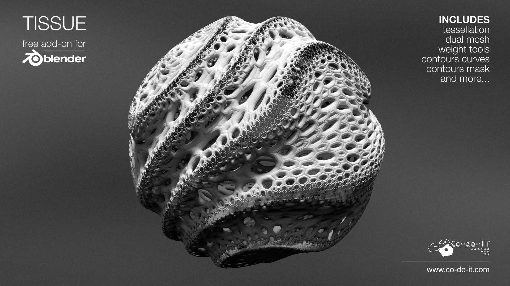

=================
Tissue
=================
-------------------------
Blender add-on for Computational Design
-------------------------

Blender 2.82a
============

Tissue v0.3.41 for Blender 2.82a (latest stable release): https://github.com/alessandro-zomparelli/tissue/releases/tag/v0-3-41

Development branch (usually the most updated version): https://github.com/alessandro-zomparelli/tissue/tree/b280-dev

Installation
============

1. Start Blender. Open User Preferences, the addons tab
2. Search for Tissue add-on and remove existing version
3. Click "install from file" and point Blender at the downloaded zip ("Install..." for Blender 2.80)
4. Activate Tissue add-on from user preferences
5. Save user preferences if you want to have it on at startup. (This could be not necessary for Blender 2.80 if "Auto-Save Preferences" id on)

Introduction
============

Tissue is an add-on fro Blender
This is an example reStructuredText document that starts at the very top
with a title and a sub-title. There is one primary header, Introduction.
There is one example subheading below.
The document is just plain text so it is easily readable even before
being converted to HTML, man page, PDF or other formats.

Subheading
----------

The basic syntax is not that different from Markdown, but it also
has many more powerful features that Markdown doesn't have. We aren't
taking advantage of those yet though.

- Bullet points
- Are intuitive
- And simple too
